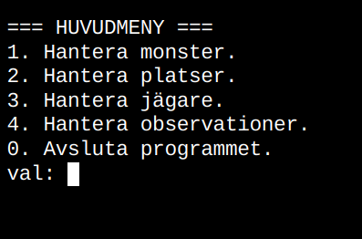
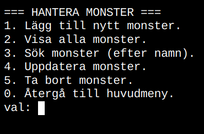
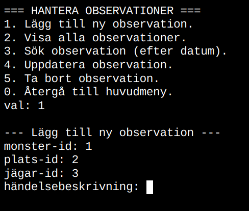
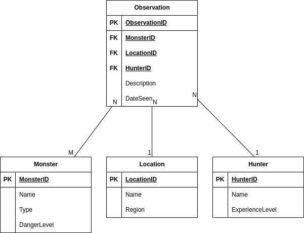

# Monster Tracker – Claes Fransson

**Kurs:** Databashantering och design
**Datum:** 2 november 2025
**GitHub:** https://github.com/Campus-Molndal-CLO25/assignment-sql-81clafra

---

## 📋 Projektbeskrivning

Monster Tracker är ett konsolbaserat system för att logga och analysera monsterobservationer i staden Grimville. Programmet använder en SQLite-databas i tredje normalformen (3NF) och implementerar fullständig CRUD-funktionalitet för hantering av monster, platser, jägare och observationer.

Systemet gör det möjligt för jägare att:
- Registrera nya monster och platser
- Logga observationer med detaljerade beskrivningar
- Söka och filtrera data
- Generera rapporter och statistik över monsteraktivitet

---

## 🖼️ Screenshots

### Huvudmeny

*Programmets huvudmeny med navigation till olika funktioner*

### Hantera Monster

*CRUD-gränssnitt för monsterhantering*

### Observation av monster

*Formulär för att registrera nya monsterobservationer*


---

## 🚀 Kom igång

### Förutsättningar

- .NET 9.0 SDK eller senare
- Terminal/kommandotolk
- SQLite (ingår i `System.Data.SQLite`)

### Installation

1. **Klona repositoryt:**
   ```bash
   git clone https://github.com/Campus-Molndal-CLO25/assignment-sql-81clafra.git
   cd assignment-sql-81clafra
   ```

2. **Återställ NuGet-paket:**
   ```bash
   dotnet restore
   ```

3. **Bygg projektet:**
   ```bash
   dotnet build
   ```

### Körning

```bash
dotnet run
```

Vid första körningen skapas automatiskt:
- `MonsterTracker.db` – SQLite-databasen
- Nödvändiga tabeller enligt schema


---

## 📚 Funktioner

### ✅ Grundfunktioner (G)

- **CRUD för Monster**
  - Skapa nya monster med namn, typ och farlighetsnivå
  - Visa alla registrerade monster
  - Uppdatera monsterinformation
  - Radera monster (med hantering av FK-constraints)

- **CRUD för Location**
  - Registrera platser med namn, region och koordinater
  - Lista alla platser
  - Uppdatera platsinformation
  - Radera platser

- **CRUD för Hunter**
  - Lägg till jägare med namn och erfarenhetsnivå
  - Visa alla jägare
  - Uppdatera jägarinformation
  - Radera jägare

- **CRUD för Observation**
  - Skapa observationer genom att koppla monster, plats och jägare
  - Lägg till beskrivning och datum
  - Visa alla observationer med komplett information
  - Uppdatera observationer
  - Radera observationer

- **Parametriserade SQL-queries**
  - Alla databasoperationer använder parametrar
  - Skydd mot SQL-injektion

- **Single Responsibility Principle (SRP)**
  - Separata klasser för varje ansvar:
    - `MonsterRepository`, `LocationRepository`, etc. – dataåtkomst
    - `ConsoleUI` – användarinteraktion
    - `DatabaseConnection` – anslutningshantering

- **Facade-mönster**
  - `MonsterTrackerFacade` – förenklad ingång till systemets funktionalitet
  - Kapslar in komplex logik från användargränssnittet

- **Felhantering**
  - Validering av användarinput
  - Hantering av databasfel
  - Tydliga felmeddelanden

---

## 🗄️ Databasdesign

### ER-Diagram


### Tabellstruktur

**Monster** (Id, Name, Type, DangerLevel)
**Location** (Id, Name, Region, Coordinates)
**Hunter** (Id, Name, ExperienceLevel)
**Observation** (Id, MonsterId, LocationId, HunterId, Description, DateSeen)

### Normalisering (3NF)

Databasen är designad enligt tredje normalformen:
- **1NF:** Alla kolumner innehåller atomära värden
- **2NF:** Inga partiella beroenden (alla attribut beror på hela primärnyckeln)
- **3NF:** Inga transitiva beroenden (attribut beror inte på andra icke-nyckel-attribut)

**Exempel på 3NF-efterlevnad:**
- Monsterinformation (Name, Type, DangerLevel) finns endast i Monster-tabellen
- Observation refererar till Monster via MonsterId (främmande nyckel)
- Detta undviker duplicering och säkerställer dataintegritet

---

## 🏗️ Arkitektur och kodstruktur

### Projektstruktur

```
MonsterTracker/
├── Models/
│   ├── Monster.cs            # Datamodell för monster
│   ├── Location.cs           # Datamodell för platser
│   ├── Hunter.cs             # Datamodell för jägare
│   └── Observation.cs        # Datamodell för observationer
├── Data/
│   ├── DatabaseConnection.cs # Hanterar SQLite-anslutningar
│   ├── MonsterRepository.cs  # CRUD för Monster
│   ├── LocationRepository.cs # CRUD för Location
│   ├── HunterRepository.cs   # CRUD för Hunter
│   └── ObservationRepository.cs # CRUD för Observation
├── Services/
│   ├── MonsterTrackerFacade.cs # Facade-mönster
│   └── DatabaseSeeder.cs     # Testdata-generering (VG)
├── UI/
│   └── ConsoleUI.cs          # Användarinteraktion
├── Program.cs                # Programinmatningspunkt
└── monstertracker.db         # SQLite-databas (skapas vid körning)
```

### Design patterns

**Single Responsibility Principle (SRP):**
- Varje klass har ett tydligt definierat ansvar
- `MonsterRepository` hanterar endast Monster-relaterade databasoperationer
- `ConsoleUI` ansvarar endast för användarinteraktion
- `DatabaseConnection` hanterar endast databasanslutningar

**Facade Pattern:**
- `MonsterTrackerFacade` ger ett förenklat gränssnitt till systemet
- Döljer komplexitet från `Program.cs` och UI-lager
- Koordinerar operationer mellan flera repositories

### Kodkvalitet

- **Namngivning:** Tydliga och beskrivande namn på klasser, metoder och variabler
- **Kommentarer:** Dokumentation av komplex logik och affärsregler
- **Felhantering:** Try-catch-block med specifik felhantering
- **Parametriserade queries:** Alla SQL-frågor använder säkra parametrar

---

## 🧪 Testning

### Manuella tester utförda

- [x] Skapa monster med olika farlighetsnivåer
- [x] Registrera platser
- [x] Logga observationer och verifiera relationer
- [x] Försök radera monster som har observationer (FK-constraint test)
- [x] Uppdatera befintliga poster
- [x] Testa felhantering med ogiltig input
- [x] Verifiera att alla menyer fungerar korrekt

---

## 🐛 Kända buggar och begränsningar

> **Viktigt:** Var ärlig om eventuella brister. Det visar mognad och ger läraren kontext.

- Inga kända buggar för närvarande

**Potentiella förbättringar:**
- Validering av GPS-koordinater kunde vara mer robust
- Datumsformat kunde valideras strängare (just nu accepteras alla TEXT-värden)
- Menynavigering kunde förbättras med breadcrumbs
- [Lägg till dina egna reflektioner här]

---

## 📖 Lärdomar och reflektion

> **Tips:** Skriv 2-3 meningar om din största lärdom. Detta kompletterar din reflection.md.

Genom detta projekt har jag fått djupare förståelse för databasnormalisering och varför 3NF är viktigt för att undvika dataduplicering. Implementeringen av Repository-mönstret och Facade visade tydligt värdet av separation of concerns, vilket gjorde koden lättare att testa och underhålla.

Den största utmaningen var att hantera främmande nycklar korrekt och förstå när SQLite kastar FK-constraint-fel. Detta lärde mig vikten av robust felhantering i databasapplikationer.

---

## 🙏 Erkännanden och källor

### Hjälp och samarbete

- **Lärare:** Fick hjälp med att förstå 3NF och transaktioner
- **Kurskamrater:** Diskuterade Repository-mönster med [Namn]
- **AI-verktyg:** Använde Perplexity.ai för att:

  - Förstå hur SqliteException.SqliteErrorCode fungerar
  - Få förslag på SQL-queries för rapporter
  - Felsöka problem med främmande nycklar

### Dokumentation och resurser

- [Microsoft.Data.Sqlite dokumentation](https://learn.microsoft.com/en-us/dotnet/standard/data/sqlite/)
- [SQLite foreign key constraints](https://www.sqlite.org/foreignkeys.html)
- [Repository Pattern explained](https://medium.com/@pererikbergman/repository-design-pattern-e28c0f3e4a30)
- [Facade Pattern (Refactoring Guru)](https://refactoring.guru/design-patterns/facade)

### Kod från externa källor

Om du använt kod från externa källor, dokumentera det här:

```csharp
// CSV-export-metoden inspirerad av exempel från Stack Overflow
// https://stackoverflow.com/questions/xxxxx
// Anpassad för att passa Monster Tracker-domänen
public void ExportToCsv(List<Observation> observations, string filename)
{
    // Min implementation...
}
```

---

## 📄 Licens

Detta projekt är skapat som en del av kursen Databashantering och design vid Campus Mölndal.

---

## 📬 Kontakt

**Student:** Claes Fransson
**Email:** claes.v.fransson@gmail.com
**GitHub:** Claes1981

---

**Skapad:** oktober 2025
**Senast uppdaterad:** [Datum]
